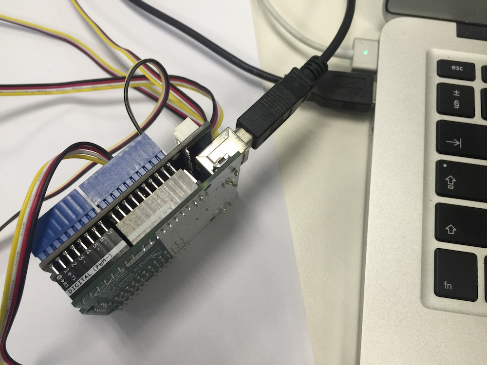
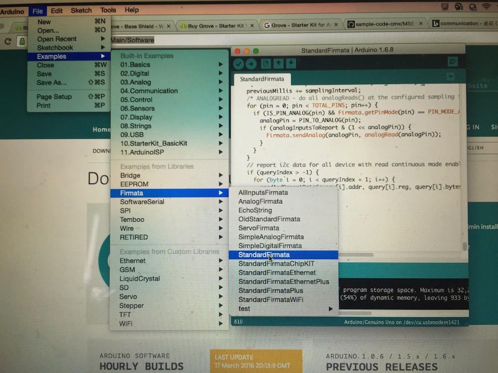
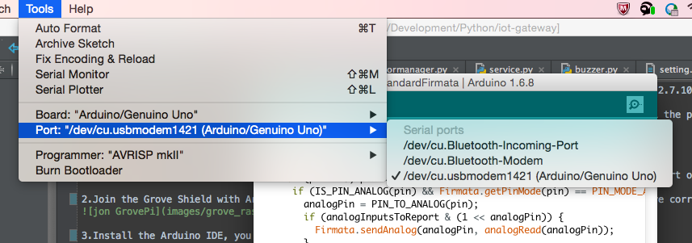
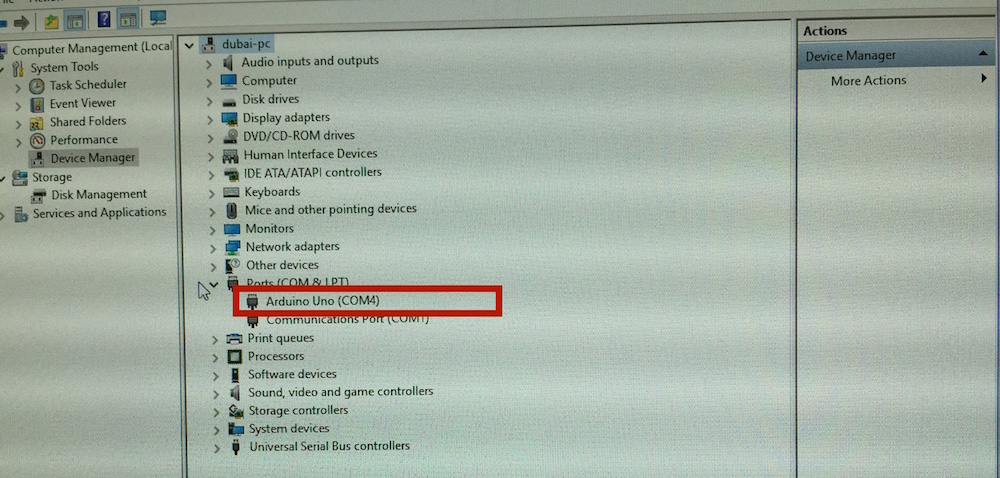
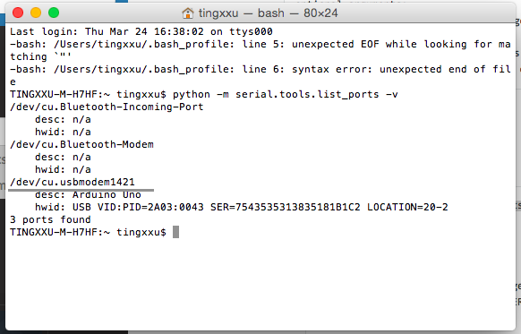
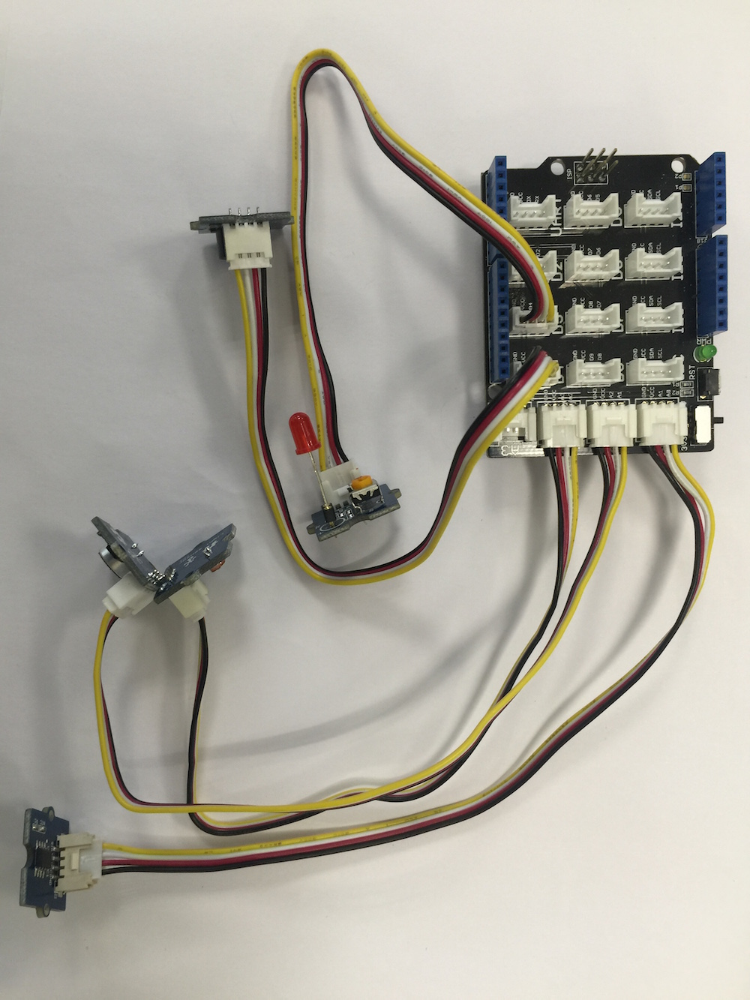
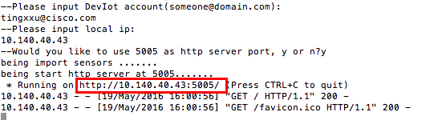

#Arduino Gateway#
Arduino is common term for a software company, project, and user community, that designs and manufactures computer open-source hardware, open-source software, and microcontroller-based kits for building digital devices and interactive objects that can sense and control physical devices

Arduino gateway service can be used to work with DevIot, supply the DevIot capability with read sensor data, control sensor status, define sensor action

This code also can be as a sample code to show how to use the Gateway Service SDK, use it build a completed gateway service which can work with [DevIoT](https://developer.cisco.com/site/devnetlabs/deviot/)

## Table of contents

* [What in this code](#what-in-this-code)
* [Prerequisite](#prerequisite)
* [How to use](#how-to-use)
* [How to test ](#how-to-test )
* [Getting help](#getting-help)

## What in this code
1.the app.py: the app entry

2.setting.cfg: the custom's setting file, you can put all you setting item in this file with json format

3.sensors folder: contain all the sensor logic model, those model map to real sensor connected to the Arduino

4.logic folder: contain some custom logic, such as how to get the data from Arduino

##Prerequisite
###Hardware###
1.This sample depended on [Arduino](http://www.arduino.cc/), you can get this pi device from [here](http://www.amazon.co.uk/Hobby-Components-Arduino-Compatible-Revision/dp/B00CG6KQO6/ref=sr_1_10?ie=UTF8&qid=1458789033&sr=8-10&keywords=arduino+board)

2.This sample use [Grove - Starter Kit for Arduino](http://www.seeedstudio.com/depot/Grove-Starter-Kit-for-Arduino-p-1855.html). This toolkit supply easy way to let the Arduino connect the sensors, and it also contain the sensors we used in this sample, you can by it by [here](http://www.seeedstudio.com/depot/Grove-Starter-Kit-for-Arduino-p-1855.html)

###Software###
3.This sample code need meet all Prerequisites the in [Prerequisite](https://cto-github.cisco.com/tingxxu/iot-gateway/blob/master/README.md)

4.This sample use pyFirmata to build the communication between Arduino and computer

##How to use
###Build the hardware###
1.Join the Grove Shield with Arduino, and use the cable connect the Arduino to the computer. if you are correct, it should be like this:

2.Install the Arduino IDE, you can download it from[here](https://www.arduino.cc/en/Main/Software)

3.Run Arduino IDE and load the StandardFirmata program as follow image:

4.Upload the StandardFirmata program to Arduino device by click the "Upload" button.(the second one at the toolbar of Arduino IDE)

###Use sample code directly###
5.Download this sample and the [gateway sdk](https://cto-github.cisco.com/tingxxu/iot-gateway/tree/master/gateway). copy the gateway folder and paste it under the arduino-pi folder. 

6.Check the serial port Arduino used. you can use the Arduino IDE to check this as follow:

in above image, the serial port is "/dev/cu.usbmodem1421"

in window system, you can also open the "Device Manager", check the "Ports" segment

in above image, the serial port is "COM4"

or:

you also can use pyserial to check the serial port by follow command:(install pyserial: sudo pip install pyserial)
    
    python -m serial.tools.list_ports -v
    

7.Open the setting.cfg and update the value of "serialport" segment with the serial port Arduino used

8.Connect the sensors to GrovePi and configuration.

In this sample,i connected button sensor to the AO port on GrovePi, Sound sensor to A1 Port, Light sensor to A2 port.Led sensor to D3 port,Buzzer sensor to D4 port

Check the connection setting in setting.cfg, as the step 1, the setting.cfg file should like this:
    
    {
    "address":"10.140.92.25:9000",                  #necessary, it is DevIot platform server address, format should be: ip:port
    "mqtthost":"10.140.92.25:1883",                 #necessary, it is the DevIot platform MQTT server address, format should be: ip:port
    "communicator": "MQTT",                         #optional, the way about connect the server, MQTT or HTTP, by default the value will be "MQTT"

    "appname":"arduino",                            #optional, the name of you gateway service app, it should not be empty, by default the value will be "arduino".
    "account":"tingxxu@cisco.com",                  #optional, your account of DevIot platform, most of the time,it should be a mail address, by default it will be empty, it means this gateway will be used for all DevIot users

    "serialport":"/dev/cu.usbmodem1421",            #necessary, it is the port number for arduino to connect the PC

    "sensors": {                                    #necessary, you need register you sensor information in here, if you don't have any sensor, keep it empty
        "button_a":                                 #necessary, sensor id is the identify id for the sensor, we suggest that you named a sensor as this format: kind_fix
            {
                "name":"AButton",                   #necessary, name is display name of sensor in DevIot platform
                "kind":"button",                    #necessary, kind is the a type identifier of sensor
                "pin": 0,                           #necessary, connect to the A0 port
                "type": "data"                      #necessary, it means A0 is readable
            },
            "sound_a":                              #necessary, sensor id is the identify id for the sensor, we suggest that you named a sensor as this format: kind_fix
            {
                "name":"ASound",                    #necessary, name is display name of sensor in DevIot platform
                "kind":"sound",                     #necessary, kind is the a type identifier of sensor
                "pin": 1,                           #necessary, connect to the A1 port
                "type": "data"                      #necessary, it means A1 is readable
            },
            "light_a":                              #necessary, sensor id is the identify id for the sensor, we suggest that you named a sensor as this format: kind_fix
            {
                "name":"ALight",                    #necessary, name is display name of sensor in DevIot platform
                "kind":"light",                     #necessary, kind is the a type identifier of sensor
                "pin": 2,                           #necessary, connect to the A2 port
                "type": "data"                      #necessary, it means A2 is readable
            },
            "led_a":                                #necessary, sensor id is the identify id for the sensor, we suggest that you named a sensor as this format: kind_fix
            {
                "name":"ALed",                      #necessary, name is display name of sensor in DevIot platform
                "kind":"led",                       #necessary, kind is the a type identifier of sensor
                "pin": 3,                           #necessary, connect to the D3 port
                "type": "action"                    #necessary, it means D3 is writeable
            },
            "buzzer_a":                             #necessary, sensor id is the identify id for the sensor, we suggest that you named a sensor as this format: kind_fix
            {
                "name":"ABuzzer",                   #necessary, name is display name of sensor in DevIot platform
                "kind":"buzzer",                    #necessary, kind is the a type identifier of sensor
                "pin": 4,                           #necessary, connect to the D4 port
                "type": "action"                    #necessary, it means D4 is writeable
            }
        }
    }

make sure the content(without the comment) in setting.cfg file is json format, you can check it in [here](https://jsonformatter.curiousconcept.com/)
    
you can add or remove the sensor segment in "sensors" segment in setting.cfg file by your requirements.

Please do not let multiple sensors use same pin.

9.Open the terminal window and cd to this folder, type follow command to run it:
    
    python app.py 

##How to test 
If in your setting.cfg file, you use MQTT as the communicator,you can use [mqtool to test you service](https://cto-github.cisco.com/tingxxu/iot-gateway/tree/master/tools)

if you use HTTP protocol, you can use postman to test your service:

* open the HTTP RESTfull API document by open the link shown in you terminal window:
    
    
    
* Use [PostMan](https://chrome.google.com/webstore/detail/postman/fhbjgbiflinjbdggehcddcbncdddomop?hl=en) to test those API.

###Program it just use gateway sdk###
if you want to know how to use the gateway sdk to program this sample, you can follow bellow steps:

1.Download the gateway SDK and copy it to you workspace folder

2.Configuration:Create a new file named setting.cfg in your workspace folder, then you can follow the relation between sensor and Grove shield port, code the setting item as follow format:
     
     "snesor id":
        {
            "name":"sensor name",
            "kind":"sensor kind",
            "pin": pin number,
            "pin_type": "analog" or "digital",
            "type": "data" or "action"
        }
here is a sample:
     
     "temperature_a":
     {
         "name":"ATemperature",
         "kind":"temperature",
         "pin": 0,
         "pin_type": "analog",
         "type": "data"
     }
it means the temperature sensor connect to the O port and the pin_type is analog(AO port), the temperature just a data sensor(readonly)

Use the "address" segment to keep the DevIot platform address and the  "serialport" to keep the serial port arduino used in setting.cfg file

it is better to organize those settings with JSON format. 

when we finished those setting, the setting.cfg file should like this:
    
    {
        "address":"10.140.92.25:80",
        "serialport":"/dev/cu.usbmodem1421",
        "sensors": {
            "temperature":
            {
                "pin": 0,
                "pin_type": "analog",
                "type": "data"
            },
            "sound":
            {
                "pin": 1,
                "pin_type": "analog",
                "type": "data"
            },
            "light":
            {
                "pin": 2,
                "pin_type": "analog",
                "type": "data"
            },
            "led":
            {
                "pin": 3,
                "pin_type": "digital",
                "type": "action"
            },
            "buzzer":
            {
                "pin": 4,
                "pin_type": "digital",
                "type": "action"
            }
        }
    }

3.Create app entry: create a new python file as the app entry in your workspace, i named this file as "app.py". in this file, typing follow code:

    from gateway.service import Service
    from gateway.config import config
    from logic.arduinopioperator import ArduinopiOperator
    if __name__ == '__main__':
    
        ArduinopiOperator.setup()
    
        address = config["address"]
        app = Service("arduino", address, False)
        app.run()

In above code, we instance a new Service, pass the DevIot address to this instance, and named this app as "pi". the third parameter is used to indicate if this app is support multiple user, the real sensor can not support multiple request, so we set this parameter as false.
The ArduinopiOperator is used to be build communication between Arduino and PC, see next step.

4.Operate the Arduino. Add a new folder named "logic"(whatever you like), add a new python file named as "ArduinopiOperator" under this folder, type follow code to this file:

    from gateway.pioperator import PiOperator
    from pyfirmata import Arduino, util
    from gateway.config import config
    
    import os
    import random
    
    PORT = config["serialport"]
    
    is_debug = False
    if "DEBUG" in os.environ:
        is_debug = os.environ['DEBUG'] == 'TRUE'
    
    
    class ArduinopiOperator(PiOperator):
        board = None
        report_cache = {}
        @staticmethod
        def setup():
            ArduinopiOperator.board = Arduino(PORT)
            it = util.Iterator(ArduinopiOperator.board)
            it.start()
    
            ArduinopiOperator.board.analog[config["sensors"]["temperature"]["pin"]].enable_reporting()
            ArduinopiOperator.board.analog[config["sensors"]['sound']['pin']].enable_reporting()
            ArduinopiOperator.board.analog[config["sensors"]['light']['pin']].enable_reporting()
    
        @staticmethod
        def write(pin, data):
            if is_debug is False:
                ArduinopiOperator.board.digital[pin].write(data)
            else:
                print("write data..." + str(data))
    
        @staticmethod
        def read(pin):
            if is_debug is False:
                return ArduinopiOperator.board.analog[pin].read()
            else:
                return random.randint(0, 100)
                
in above code, first we create Pi Operator by inherit the PiOperator class and implement the write and read method. those two method use pyFirmata to read/write data from/to Arduino.
you can from [here](https://github.com/tino/pyFirmata) to know how to use pyFirmata

Don't forget to add ArduinopiOperator.setup() in app file 

The is_debug variable to let this app can run without the real hardware, if the is_debug is True, the read method just return some random data and the write method just put out some log

5.Add sensor model and logic. create a new folder and which should be named "sensors".

after above steps, your workspace should like this:

in the sensors folder, create a new python file named "temperature",add the follow code to this file:
    
    from gateway.sensor import Sensor
    from gateway.sproperty import SProperty
    from gateway.config import config
    from gateway.sensorlogic import SensorLogic
    from logic.arduinopioperator import ArduinopiOperator
    
    
    sound = Sensor("sound", "sound_2", "ASound")
    
    value_property = SProperty("volume", 0, [0, 100], 0)
    
    sound.add_property(value_property)
    
    
    class SoundLogic(SensorLogic):
    
    
        @staticmethod
        def update(sensor, data):
            pin = config["sensors"][sensor.id]['pin']
            new_value = ArduinopiOperator.read(pin)*100
            updated_properties = {"volume": new_value}
            SensorLogic.update_properties(sensor, updated_properties)
            
In above code:

* we use Sensor class to create a sound sensor model, and define a value with SProperty class. 

* we create a static class named "SoundLogic" which inherit from SensorLogic and override the update method, in this method we use the ArduinopiOperator to read the data from the real sound sensor.

you can repeat above step to create other sensors

6.Add the __init__.py file in logic and sensor folder to make other file can refer to those files in those two folder.

## Getting help

If you have questions, concerns, bug reports, etc, please file an issue in this repository's Issue Tracker

## Getting involved

For general instructions on _how_ to contribute, please visit [CONTRIBUTING](CONTRIBUTING.md)

## Open source licensing info

1. [LICENSE](LICENSE)

## Credits and references

None